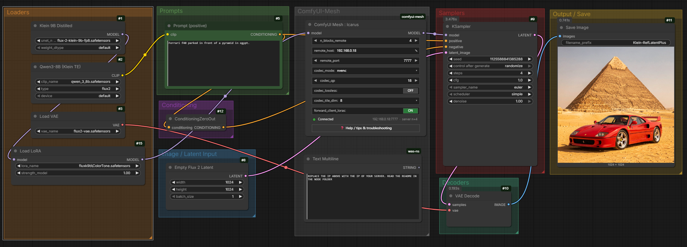
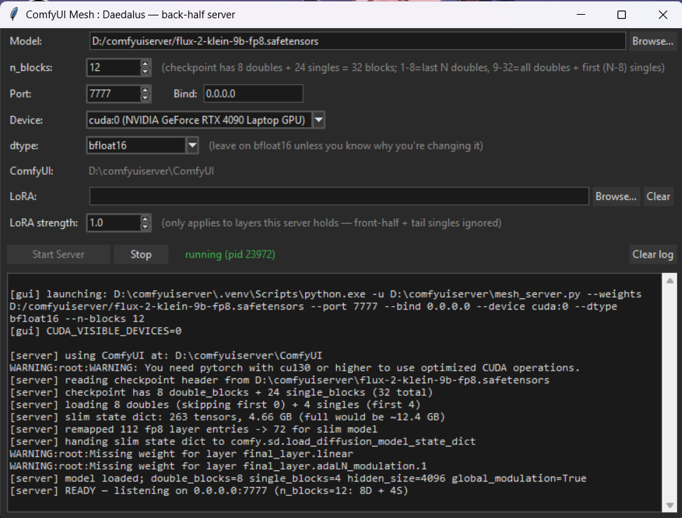

# ComfyUI-Mesh Icarus & Daedalus

**ComfyUI Mesh : Icarus** *(the ComfyUI client node)* ↔
**ComfyUI Mesh : Daedalus** *(the back-half server)*

**Split a diffusion model across two GPUs — either over a gigabit
network OR between two cards in the same machine. The activations
between them get compressed live by NVIDIA's NVENC idle silicon
through a codec I designed to abstract model activation data.**

> **Supported today:** FLUX.2 Dev, FLUX.2 Klein 9B, and **LTX 2.3
> (LTX-AV 22B Dev)**. Each has its own paired node + server launcher
> — see "Quick start" and the LTX section below. Other architectures
> (Wan, FLUX.1, SD3.5, …) are on the roadmap further down — let me
> know which one you want next.

> **Headline:** FLUX.2 Klein 9B at 1024² generates in **~4.4 seconds
> per image** split across an RTX 5090 + RTX 4090 over plain gigabit
> ethernet. Only ~0.5 s of that is wire overhead (4 sampler timesteps
> × ~130 ms round-trip) — the rest is diffusion that would have
> happened anyway. Full numbers (incl. 1536² and lossless modes)
> further down.



<a href="https://buymeacoffee.com/lorasandlenses"></a>

If this project saves you buying a new GPU, please consider donating — it helps me support more models beyond the FLUX.2 family and keep this thing maintained.

FLUX.2 Klein 9B / FLUX.2 Dev (9 GB and ~22 GB respectively) running
on one Nvidia card with its back half offloaded to another Nvidia
card elsewhere on the LAN.
**Any modern Nvidia GPU with NVENC works** — 3080 + 4080, 4070 + 5070,
5090 + 4090, whatever you have. The two cards don't have to be the
same model or generation. Or two cards in the same box without NVLink.
Or your friend's GPU over VPN. The bandwidth that would normally
make this miserable stops being the bottleneck because NVENC compresses
the bytes on the wire while they're already on the GPU.

```
                ┌─────────────────┐                     ┌─────────────────┐
                │     Icarus      │   NVENC HEVC wire   │    Daedalus     │
                │  (client node)  │ ─── ~10 MB / step ─►│  (back-half)    │
   img latent ──┤ front-half      │                     │ slim-loaded     │── img latent
                │ blocks + VAE    │ ◄────────────────── │ server          │
                └─────────────────┘    ~10 MB / step    └─────────────────┘
                       LoRAs work transparently across the wire
```

---

## The thing that's new

Every modern Nvidia GPU has dedicated **NVENC** silicon that compresses
H.265/HEVC video at sub-millisecond per frame. During ML inference it
sits 100% idle — none of the compute uses it.

This rig treats ML activations as video frames and feeds them to NVENC.
A FLUX activation tensor is `[batch, tokens, channels]`; we pack
multiple channels per Y/U/V plane in a grid, quantize per-channel to
uint8, and the codec compresses the result by 3–10× depending on QP.
The output bitstream is what crosses the wire. The receiver runs NVDEC
to reverse it.

**The codec runs on dedicated silicon that wasn't going to do anything
else anyway.** So you get compression "for free" in the sense that you
weren't using those transistors. The wire-byte savings convert directly
to wall-clock savings on any bandwidth-limited transport.

That's it. The rest is plumbing.

---

## What works today

- **FLUX.2 Dev and FLUX.2 Klein 9B.** These are the two FLUX.2
  checkpoints Black Forest Labs ships today; both tested end-to-end.
  (FLUX.1 schnell is a separate architecture and is on the roadmap
  below, not in this list.)
- **LTX 2.3 (LTX-AV 22B Dev and Distilled).** The Lightricks LTX video model with
  audio+video transformer blocks. Uses a separate Icarus LTX node
  and a separate Daedalus LTX server GUI — see the LTX section below
  for the small UX differences from the FLUX pair.
- **LoRAs**: any format ComfyUI itself supports — Kohya, Diffusers PEFT,
  BFL Flux, USO, Wan Fun, SimpleTuner, native, etc. Includes the full
  weight-adapter family: **lora, loha, lokr, glora, oft, boft**, plus
  `diff` / `set` style patches.
- **Topologies**:
  - Cross-machine over LAN (gigabit OK, 2.5G/10G better)
  - Cross-machine over VPN (residential broadband fine for
    FLUX.2-distilled's 4-step samplers)
  - Same machine with two GPUs (no NVLink required) — *the rig is
    set up to handle this cleanly but I haven't been able to test it
    end-to-end myself; community feedback welcome. See the same-host
    quickstart below for the expected setup.*

**Models that are NOT supported (yet)** — anything that isn't FLUX.2
or LTX 2.3. The architectural differences are real (block signatures,
modulation, vec structure), but they're not blockers — just code that
needs writing. Top of the queue when community demand says go:

- **Wan** (2.1 / 2.2 / VACE) — video model with very similar DiT shape
- **FLUX.1** — same family as FLUX.2, minor handling differences
- **SD3 / SD3.5** — MMDiT, related architecture
- **HunyuanVideo / Qwen-Image / Chroma** — each has its own quirks

If you want one of these added, **please consider supporting the
project** (link below) and tell me which — community demand drives
the priority list.

---

## Quick start — cross-machine (the headline use case)

Two physical machines: one running ComfyUI (**Icarus** lives here),
one running the back-half server (**Daedalus** lives here). Connected
over your LAN or VPN.

### 1. Install Icarus (the ComfyUI node) on the ComfyUI host

Pick whichever route you prefer:

**Via ComfyUI Manager** (easiest if you have it):
- Open Manager → "Install via Git URL" → paste this repo's URL → restart.

**Via git clone:**
```
cd ComfyUI/custom_nodes
git clone <repo-url> comfyui-mesh
```

**Drop-in copy:**
- Copy or unzip the `comfyui-mesh/` folder into
  `ComfyUI/custom_nodes/`.

After ComfyUI restarts, the Manager runs `pip install -r requirements.txt`
automatically — it's a single line, `cuda-bindings`. The codec wrapper
(`nvenc_pframe/`) is **bundled in the folder**, no separate install.
The Icarus node appears in the node menu under the `mesh` category.

### 2. Deploy Daedalus (the back-half server) on the OTHER machine

The `server/` subfolder of this repo is a self-contained deploy. Get
it onto the other machine by whichever means you prefer:

- **git clone the whole repo** there too, and use just the `server/`
  subfolder.
- **Copy the `server/` folder over the network** (USB stick / SMB
  share / SCP / `rsync` etc).
- **Zip + transfer** if cross-OS.

You don't need ComfyUI installed on the back-half host beforehand —
the installer below clones it for you.

Then on the back-half host, in a terminal in the `server/` folder:

1. Run the one-shot installer:
   ```
   install.bat
   ```
   Creates a `.venv`, clones ComfyUI INTO this server folder if missing,
   installs CUDA-enabled torch (cu128 — covers RTX 30/40/50 series),
   installs dependencies, runs a pre-flight check. Multi-GB,
   takes a minute or two on a fast connection. Re-runs are idempotent.

2. Drop your FLUX.2 or LTX 2.3 safetensors checkpoint into the same
   `server/` folder (e.g. `flux-2-klein-9b-fp8.safetensors`,
   `flux2_dev_fp8mixed.safetensors`, or `ltx-2.3-22b-dev-fp8.safetensors`).
   Where to get the right files:
   - **FLUX.2 Dev:** the ComfyUI docs page
     [Flux.2 Dev](https://docs.comfy.org/tutorials/flux/flux-2-dev)
     has direct links (the fp8 variants are what fit comfortably on
     consumer cards).
   - **FLUX.2 Klein 9B:** Black Forest Labs' HuggingFace repo at
     [black-forest-labs/FLUX.2-klein-9B](https://huggingface.co/black-forest-labs/FLUX.2-klein-9B/tree/main).
   - **LTX 2.3 (LTX-AV 22B Dev and Distilled):** Lightricks' HuggingFace
     repo at [Lightricks/LTX-2.3-fp8](https://huggingface.co/Lightricks/LTX-2.3-fp8/tree/main).
     Repo contains both the base model and a pre-distilled variant —
     pick whichever fits your workflow.

3. Launch via the GUI (recommended for first run):
   ```
   run_server_flux2_gui.bat     (FLUX 2)
   run_server_ltx_gui.bat       (LTX-AV)
   ```
   Pick the model file, pick `n_blocks` (how many blocks to host —
   spinbox shows the range, default 4), pick port, click **Start
   Server**.

   

The server prints `[server] READY — listening on 0.0.0.0:7777 (n_blocks=4: 4D + 0S)` when ready.

**For more detail** (manual install path, headless `.bat` launchers,
same-host two-GPU pinning, troubleshooting matrix, log-format
reference, network setup tips, `update_comfy.bat` for keeping the
server's ComfyUI in sync with the client's): see the
[`server/README.md`](server/README.md).

### Wire it up in a workflow

```
UNETLoader  →  (optional LoraLoader)  →  Icarus  →  KSampler
```

A ready-to-load demo workflow ships with the repo at
[`workflows/klein-9b-example.json`](workflows/klein-9b-example.json) —
drag-and-drop it into ComfyUI to see the full graph wired up.

Set on the `Icarus` node:

- **`n_blocks_remote`** = same number as the server's GUI (default 4)
- **`remote_host`** = the server's LAN IP, e.g. `192.168.0.18`, or
  VPN IP `100.x.x.x`
- **`remote_port`** = `7777`
- **`codec_mode`** = `nvenc`, **`codec_qp`** = `18`, **`codec_tile_dim`** = `8`
- **`forward_client_loras`** = **ON** (so any LoraLoader-loaded LoRA
  affects the back half too)

Queue a generation. Server log shows one `[server] forward …` line
per timestep, with byte counts. Done.

#### ⚠️ Important: FLUX.2 Dev + the FLUX.2 turbo LoRA — load it on BOTH sides, NOT via forwarding

If you're running FLUX.2 Dev with the **FLUX.2 turbo LoRA** (the
distillation LoRA that lets you sample in 4 steps instead of the
default ~30), do NOT let Icarus forward it across the wire. The
turbo LoRA is **~2.5 GB** — much bigger than typical character /
style LoRAs. Forwarding it pushes the laptop / smaller GPU server
into a memory-pressure regime that **adds seconds per timestep** to
the codec encode time, completely killing the speed-up the rig is
supposed to give you.

The right setup is a **two-sided load** that never ships the LoRA
across the wire:

1. **On the server:** load the turbo LoRA via Daedalus's GUI LoRA
   picker. Applies to the back-half blocks server-side.
2. **On the client:** place a `LoraLoader` for the same turbo LoRA
   in the workflow **to the RIGHT of the Icarus node** (i.e.
   between Icarus and KSampler). Applies to the front-half blocks
   locally.

The "after Icarus" position is the trick — `forward_client_loras`
deliberately does NOT capture post-Icarus patches (so they stay
local-only), and the server already has its copy from step 1. Net
result: the whole model gets the LoRA, but the wire never carries
it.

This applies to any large LoRA (>~500 MB), not just turbo. For
small character / style LoRAs the normal "LoraLoader BEFORE Icarus
+ `forward_client_loras=ON`" pattern is fine and convenient.

---

## LTX 2.3 — separate node + separate server GUI

LTX 2.3 (the Lightricks LTX-AV 22B Dev model) uses its own paired
client node and server launcher, alongside the FLUX ones. Both halves
of the rig live in the same install — pick which node + launcher to
use based on which model you're running.

### Client side

In the ComfyUI node menu under `mesh` you'll see two nodes:

- **`ComfyUI Mesh : Icarus`** — for FLUX.2 Dev / Klein 9B.
- **`ComfyUI Mesh : Icarus LTX`** — for LTX 2.3.

Drop `Icarus LTX` between the LTX model loader and the LoraLoader /
sampler chain. A ready-to-load demo workflow ships at
[`workflows/LTX-example.json`](workflows/LTX-example.json).

The LTX node has a deliberately smaller surface than the FLUX one:

| Parameter | Default | What it controls |
|---|---|---|
| `model` | — | The loaded LTX-AV MODEL |
| `n_blocks_remote` | 8 | How many of LTX's 48 transformer_blocks run remotely. Increase = more offload, smaller client VRAM. |
| `remote_host` | `127.0.0.1` | Hostname/IP of the back-half server |
| `remote_port` | `7777` | TCP port |
| `codec_mode` | `Nvenc LTX` | `Nvenc LTX` = LTX-tuned codec (NVENC HEVC + per-channel percentile-clip quant + sparse exact-correction of outliers; near-raw quality, ~3× smaller than raw, roughly the same wall-clock as raw on gigabit). `nvenc` = plain NVENC HEVC, lighter wire, can show contrast crush on LTX. `raw` = uncompressed bf16. |
| `forward_client_loras` | **OFF** | Same semantics as the FLUX node, but defaulted OFF on LTX because the LTX-AV 22B back-half is heavy enough that forwarding LoRAs can push <24 GB back-half cards into ComfyUI's dynamic-offload thrash regime (see warning below). Turn ON only if your back-half has 24+ GB free for LoRA buffers. |

**Use `Nvenc LTX`** — it's the best speed/quality balance for the LTX
node (the tuned settings are pinned internally). If you ever need to
A/B against an uncompressed baseline, switch to `raw`. The plain
`nvenc` option is kept for completeness but isn't recommended for
LTX content.

There are no `codec_qp` / `codec_lossless` / `codec_tile_dim` widgets
on the LTX node — those are pinned internally at the sweet spot that
works for LTX activations.

#### ⚠️ Workflow placement — LoraLoader position depends on intent

The Icarus LTX node should sit between the LTX model loader and
KSampler. **Where you put your LoraLoader relative to Icarus LTX
controls whether the LoRA reaches the server's back-half blocks:**

- **LoraLoader BEFORE Icarus LTX** (with `forward_client_loras=ON`)
  → the LoRA's patches are on the patcher when Icarus LTX captures
  it; per timestep the node filters + remaps the back-half-targeting
  patches, ships them via safetensors-encoded blob (only on session
  change, not every step), and the server applies them to its slim
  model. Net effect: the LoRA covers the whole model.
  ```
  LTX model loader → LoraLoader → Icarus LTX → KSampler
  ```

- **LoraLoader AFTER Icarus LTX** → the LoRA applies only to the
  front-half blocks running locally; the server's back-half never
  sees it. Use this when you specifically want a local-only LoRA, or
  when the LoRA is already loaded server-side (see next note) and
  you don't want to ship it.
  ```
  LTX model loader → Icarus LTX → LoraLoader → KSampler
  ```

The first call after a LoRA change ships the encoded blob (can be
hundreds of MB for big LoRAs); subsequent timesteps within the same
generation send only the small session id. Swap LoRAs across gens
and the next gen pays the blob cost once.

#### ⚠️ Distilled LoRA — load it in the server, not in the workflow

If you're using the LTX 2.3 distilled LoRA (the standalone .safetensors,
not the pre-distilled model variant), **always load it via the
Daedalus LTX server GUI's "Distill LoRA" row, NOT via a workflow
LoraLoader**. The server applies it once at startup to the
back-half blocks; the client applies the same LoRA locally to the
front-half blocks (place a LoraLoader AFTER Icarus LTX with the same
file, so it stays local-only). Net effect: the LoRA covers the
whole model without ever crossing the wire.

The alternative — putting it in a workflow LoraLoader BEFORE Icarus
LTX with `forward_client_loras=ON` — would ship the LoRA bytes
across the network on every fresh generation that triggers a
session-id change. For the LTX distilled LoRA specifically that's
hundreds of MB of wasted wire time for a LoRA that never changes.
The server-side slot is the right home for any "always-on" LoRA
you'd otherwise forward.

#### ⚠️ Big LTX LoRAs — load on server + LoraLoader to the RIGHT of Icarus LTX

LTX-family LoRAs are frequently **large** — often >500 MB, sometimes
into the gigabytes. Shipping a LoRA that big across the wire on
every session change adds seconds (or tens of seconds on slower
links) to the generation, AND adds memory pressure on the server
that can push the codec encode into a slow regime — same mechanism
as the FLUX turbo-LoRA gotcha further up.

The right pattern for a LoRA >~500 MB is **two-sided load** that
never crosses the wire:

1. **On the server:** load it via the Daedalus LTX GUI's primary
   LoRA row (the one above the Distill LoRA row).
2. **On the client:** place a `LoraLoader` for the same file
   **to the RIGHT of Icarus LTX** (i.e. between Icarus LTX and
   KSampler). The post-Icarus position means the LoRA applies
   to the front-half blocks locally and `forward_client_loras`
   never sees it.

Net result: the whole model gets the LoRA, but the wire only ever
carries activations.

For sub-500 MB LoRAs the "LoraLoader BEFORE Icarus LTX +
`forward_client_loras=ON`" pattern is fine and convenient — the
encoded blob ships once per session-id change, subsequent timesteps
within the gen send only the small id.

#### ⚠️ Strongly discouraged — `forward_client_loras=ON` on a server with <24 GB VRAM

**Don't use `forward_client_loras=ON` on a back-half server with
less than 24 GB of VRAM for LTX.** The LTX-AV 22B back-half slim-load
plus any active LoRAs plus codec scratch buffers will tip a 12 / 16 /
20 GB server into ComfyUI's dynamic offload regime, where weights
get paged in and out of VRAM mid-generation. Symptom: per-step
forward time on the server jumps from ~1–2 s to ~5–10 s once a
forwarded LoRA gets applied — that's offload thrash.

On a 24+ GB back-half server, forwarding is fine and the bytes
amortise well across the session-id cache.

If your back-half is under 24 GB, use the **two-sided load** pattern
above for ANY LoRA you'd otherwise forward, not just the big ones:

- Server-side slot (primary or Distill LoRA row in the Daedalus LTX GUI)
- Local-only LoraLoader on the same file, placed to the RIGHT of
  Icarus LTX in the workflow so `forward_client_loras` doesn't see it.

That covers the whole model without ever asking the server to
allocate a transient LoRA buffer on the fly.

#### Server VRAM headroom — 16+ GB recommended

A practical note on sizing the back-half host: **with 16+ GB of
VRAM the LTX server has comfortable room** to slim-load 8–24
back-half blocks AND stack one or two LoRAs on top. On a 12 GB
card (or smaller) you may need to keep `n_blocks_remote` near the
default of 8 (or even lower) to fit a sizeable LoRA without
bumping into ComfyUI's
dynamic-offload heuristics, which start swapping weights in and
out of VRAM mid-generation and can slow the per-step forward
noticeably. Symptom to watch for: per-step forward time on the
server jumping from ~1–2 s to ~5–10 s once a big LoRA is applied
— that's the offload thrash signature, not anything we ship.

### Server side

The server side ships **two** GUIs side-by-side in the same `server/`
folder:

- **`run_server_flux2_gui.bat`** — Daedalus for FLUX 2 (existing).
- **`run_server_ltx_gui.bat`** — Daedalus LTX for LTX 2.3.

Launch whichever matches the client node you're using. They have
distinct settings files and run as independent processes — you can
keep both installed and toggle by closing one and launching the other
(they default to the same port 7777 so don't try to run them
simultaneously without changing one).

The LTX server GUI has the same model picker + n_blocks + port +
device + dtype rows as the FLUX one, plus **two LoRA slots** instead
of one:

- **LoRA / LoRA strength** — primary slot (default strength 1.0).
  Use this for your character or style LoRA.
- **Distill LoRA / Distill strength** — secondary slot (default
  strength **0.5**). Intended for the **LTX 2.3 Distilled LoRA**,
  which most LTX workflows stack on top of the base model. Default
  0.5 matches the typical strength.

Both server-side LoRAs apply to the slim-loaded back-half blocks at
server startup (or restart on a settings change). Stacking them
server-side avoids the wire cost of forwarding them per generation.

`n_blocks` on the server GUI defaults to **8** to match the LTX
client node's default. Persisted settings still win on subsequent
launches.

---

## Quick start — same machine, two GPUs (no NVLink)

ComfyUI (Icarus) and the back-half server (Daedalus) live on the same
machine but each pinned to a different GPU. You get to use any pair
of NVENC-capable Nvidia cards (3080 + 4080, 4090 + 5090, mix-and-
match) without buying NVLink-capable cards.

> **Heads-up on testing.** I've set this rig up to handle the
> same-host two-GPU topology cleanly — the GPU-pinning launchers, the
> `codec_mode=raw` shortcut on PCIe, the loopback host — but I haven't
> personally been able to run an end-to-end same-host test on a
> two-GPU box. The pieces should all work; if you hit a snag, please
> open an issue (or ping me) so we can shake it out. Community
> feedback on this path is genuinely useful.

1. On the same host, install Icarus (as above) and deploy Daedalus
   (as above) — both can sit on the same machine.
2. Launch ComfyUI normally — it grabs whatever GPU it sees first
   (usually `cuda:0`).
3. Launch Daedalus **pinned to the OTHER GPU**:
   ```
   run_server_flux2_gpu1.bat   # pins FLUX 2 server to physical GPU 1
   run_server_ltx_gpu1.bat     # or the LTX variant
   ```
   (or the `_gpu0` equivalents if ComfyUI is on GPU 1.) These set
   `CUDA_VISIBLE_DEVICES` so the two processes don't fight over the
   same card.
4. In the workflow, set `remote_host = 127.0.0.1` (loopback).

That's it. The two processes share PCIe but each only sees its own
GPU.

**Specifically for same-host setups:** since PCIe between two GPUs in
the same desktop is ~32 GB/s — much faster than what the codec
encode/decode takes — you'll get better wall-clock with
`codec_mode = raw` instead of `nvenc`. The codec is the right tool for
slow wires (LAN, VPN, residential broadband); on PCIe it's
overkill and adds latency. Set `codec_mode = raw` for same-host pairs.

---

## What the two nodes do

### `Icarus`

Pass-through MODEL node. Slot it between the model loader (or
LoraLoader) and the sampler.


Its parameters:

| Parameter | Default | What it controls |
|---|---|---|
| `model` | — | The loaded FLUX MODEL |
| `n_blocks_remote` | 4 | How many transformer blocks run remotely (counts double-blocks first, then single-blocks). For FLUX.2 Klein 9B: max 32. For FLUX.2 Dev: max 56. Change handling is inline — see "Live UX" below. |
| `remote_host` | `127.0.0.1` | Hostname or IP of the back-half server. 127.0.0.1 = same machine. 192.168.x.x = LAN. 100.x.x.x = VPN. |
| `remote_port` | `7777` | TCP port the back-half server is listening on |
| `codec_mode` | `nvenc` | `nvenc` for slow wires (LAN, VPN, residential broadband). `raw` for same-host PCIe (faster than codec encode/decode latency). |
| `codec_qp` | `18` | NVENC quality. 10=near-lossless, 18=sharp (default), towards 28 the image gets noticeably softer with visible noise |
| `codec_lossless` | OFF | NVENC lossless tuning (still has uint8 quant floor) |
| `codec_tile_dim` | `8` | Channels-per-frame tile size. Higher = fewer larger NVENC frames = ~5× faster. 8 is the default; 4 is also fine if you want a touch more codec headroom. |
| `forward_client_loras` | ON | Ship client-side LoraLoader patches to server so the LoRA effect covers back-half blocks too |

---

## Live UX on the node

The `Icarus` node has a few inline UI behaviours so you don't
have to hunt the console for status:

- **Always-on connection indicator** at the bottom: green dot = client
  connected to the mesh server, red = disconnected (server died or
  network gone), grey = idle (no queue this session yet). Right side
  shows `host:port · server n=N` so you can see at a glance what
  you're talking to and what its `--n-blocks` is. Polls every 3s.

- **Confirm-restart button** (orange, bold) appears when you change
  `n_blocks_remote` — it's a pending state that won't actually take
  effect until you click it. Clicking POSTs the new value to the
  server, which restarts itself with the new `--n-blocks`. The button
  disappears when the round-trip completes. Until then, queueing the
  workflow is blocked with a clear "click Confirm first" message —
  prevents the silent-wrong-output footgun of mismatched n on the
  two sides.

- **Inline banner** under the node body for important warnings — most
  notably "decreasing n_blocks_remote requires a ComfyUI restart"
  (the client's stripped weights for the back-half blocks are gone
  for the session and can only be reloaded from disk by a fresh
  ComfyUI launch).

- **Last-used values remembered** across fresh node drops. Drop a
  `Icarus` into a brand-new workflow and your last
  `remote_host` / `n_blocks_remote` / `codec_qp` etc. come back
  pre-filled. Loading a saved workflow always wins over the
  remembered defaults.

- **Transparent reconnect** if the server dies and comes back. The
  cached client socket gets reset; the connection indicator's
  background poll attempts a fresh handshake every few seconds and
  flips green automatically the moment the server is back — no need
  to queue a workflow first to see whether you're back online. Works
  whether the server crashed, restarted itself for a reconfigure, or
  you killed and re-launched it manually.

- **Per-control tooltips** on hover. Every parameter has a one-line
  explanation that ComfyUI surfaces when your mouse rests on the
  pill. Useful for picking sensible values without hunting the docs.

- **❓ Help button** at the very bottom of the node opens an inline
  modal with categorised tips: connection troubleshooting, the
  Confirm-restart flow, LoRA workflow ordering, codec quality
  trade-offs, and the ComfyUI-version-mismatch gotcha (which we
  can't auto-detect because the wire protocol doesn't carry the
  server's ComfyUI version — `update_comfy.bat` on the server side
  is the standing fix).

---

## Honest performance numbers

End-to-end wall-clock per generated image. FLUX.2 Klein 9B distilled,
4 sampler steps, RTX 5090 desktop client + RTX 4090 laptop server,
gigabit ethernet, `n_blocks_remote = 12`, `tile_dim = 8`.

| Resolution | NVENC `qp = 18` | NVENC lossless | Raw (no codec) |
|---|---:|---:|---:|
| 1024 × 1024 | **4.38 s** | 4.70 s | 7.20 s |
| 1536 × 1536 | **4.41 s** | 5.15 s | 9.13 s |

A few things worth pulling out of that table:

- **Compression beats raw by a wide margin and the gap widens with
  resolution.** At 1024² the codec saves you ~2.8s per image (39%
  faster); at 1536² it saves ~4.7s (52%). Activations grow with
  resolution but NVENC compresses bigger frames just as well, so the
  wire stops being the bottleneck.
- **NVENC `qp=18` is essentially free vs lossless** at default settings
  — 0.3s difference at 1024², 0.7s at 1536² — and FLUX's residual
  stream absorbs the QP=18 codec noise comfortably (cosine similarity
  > 0.995 per round-trip; visually indistinguishable from all-local at
  the same seed up to roughly QP=28).
- **Resolution barely affects NVENC wall-clock** (4.38 → 4.41s, ~1%
  increase from 1024² to 1536²), because the codec compresses the
  bigger activations to similar wire payloads. Raw mode jumps 27% over
  the same resolution increase because every extra byte traverses the
  wire literally.

Headline: at QP=18 you're paying about **~130 ms per timestep** for
the codec encode + LAN + remote forward + LAN + codec decode, regardless
of which side has the bigger activations. The rest of the image-time is
diffusion that would have happened anyway.

---

## Honest limits

- **FLUX.2 and LTX 2.3 family today.** Other architectures (Wan,
  FLUX.1, SD3.5, HunyuanVideo, etc.) need per-model code (block
  signatures, modulation, vec structure differ). Open to contributions
  or sponsored work.
- **Workflow ordering for client-LoRA forwarding**: LoraLoader
  position relative to `Icarus` / `Icarus LTX` controls intent.
  BEFORE the mesh node + `forward_client_loras=ON` → LoRA covers the
  whole model (front locally + back forwarded to server). AFTER the
  mesh node → LoRA stays local. Tooltips on the nodes warn about
  this.

  Correct (LoraLoader → Icarus → KSampler):

  

  Wrong (Icarus → LoraLoader → KSampler) — LoRA only affects the
  front-half blocks; the back-half running on Daedalus never sees it:

  
- **Decreasing `n_blocks_remote` requires a ComfyUI restart.**
  The client slim-load strips back-half block weights in place to free
  VRAM (the whole point — the server already has those blocks, the
  client doesn't need to hold them too). **Increasing** `n_blocks_remote`
  works seamlessly — the strip extends incrementally to cover more
  blocks, the Confirm button restarts the server, no client reload
  needed. **Decreasing** would require un-stripping the weights, but
  those weights are gone for the session. The inline banner under the
  node tells you to restart ComfyUI; the next launch re-reads the
  model from disk and applies the new (smaller) `n_blocks_remote`.
- **Sequential request/response.** No CUDA-stream overlap of codec
  work with compute. The FLUX sampler is inherently sequential per
  timestep, so this caps the headroom anyway.
- **One client at a time.** Server is single-tenant. Connecting a
  second client kicks the first.

---

## Support the project

This is independent work by one person. If it saves you the cost of an
extra GPU, or you'd just like more FLUX-family models / architectures
supported, **donations make this go faster**:

<a href="https://buymeacoffee.com/lorasandlenses"></a>

**Why it matters to me**

I'm a parent working from home, supporting a long-term ill child alongside my wife. As much as this dev work is a passion, it's also a needed distraction — and donations genuinely help keep the lights on right now.

What more support unlocks:
- **More model architectures.** Highest leverage targets:
  **Wan** (image + video, hugely popular ComfyUI workload),
  **FLUX.1** (small lift from FLUX.2),
  **SD3.5**, **HunyuanVideo**, **Qwen-Image**, **Chroma**.
- **Multi-LoRA server-side stacking on FLUX** (the LTX server GUI
  already has two LoRA slots — primary + distill — but the FLUX GUI
  is still single-slot)
- **Multi-client server mode** — rent your back-half GPU out
- **CUDA-stream overlap** — codec hides behind compute for genuine
  wall-clock parity with all-local
- **Activation pre-stage cache** — the LTX path already does this
  (per-generation constants cache for context tensors + PE pairs);
  porting to FLUX is the symmetric extension

---

## Files

```
comfyui-mesh/
├── README.md                     ← this file
├── requirements.txt              ← ComfyUI auto-installs (cuda-bindings)
├── __init__.py                   ← ComfyUI node registration + WEB_DIRECTORY
├── mesh_node.py                  ← MeshSplitFlux + /mesh/status + /mesh/reconfigure HTTP routes
├── mesh_node_ltx.py              ← MeshSplitLTX + /mesh/ltx/status + /mesh/ltx/reconfigure
├── codec.py                      ← tensor ↔ NVENC bitstream (per-channel uint8 + HEVC, plus Nvenc LTX mode)
├── protocol.py                   ← length-prefixed TCP framing
├── vec_io.py                     ← FLUX.2 vec/modulation tuple (de)serializer
├── payload_ltx.py                ← LTX-AV per-block payload (de)serializer (constants cache, PE 3-tuples, CompressedTimestep)
├── lora_io.py                    ← safetensors-based LoRA patch shipping
├── web/mesh.js                   ← FLUX Icarus pill widgets, banner, Confirm button, connection light
├── web/mesh_ltx.js               ← LTX Icarus equivalents (polls /mesh/ltx/status)
├── workflows/klein-9b-example.json  ← drop-in FLUX.2 Klein 9B demo workflow
├── workflows/LTX-example.json    ← drop-in LTX 2.3 demo workflow
├── smoke_test_codec.py           ← standalone codec roundtrip test
├── nvenc_pframe/                 ← BUNDLED NVENC codec wrapper (no separate install)
└── server/                       ← deploy folder for the back-half host
    ├── README.md
    ├── CLAUDE.md
    ├── install.bat               ← one-shot installer
    ├── requirements.txt
    ├── mesh_server.py            ← FLUX slim-load TCP server
    ├── mesh_server_gui.py        ← FLUX Tkinter wrapper
    ├── mesh_server_ltx.py        ← LTX slim-load TCP server (LTX-AV variant detection, dual LoRA slots)
    ├── mesh_server_ltx_gui.py    ← LTX Tkinter wrapper (extra Distill LoRA row)
    ├── codec.py / protocol.py / vec_io.py / lora_io.py / payload_ltx.py / nvenc_pframe/  ← wire-contract mirrors (byte-identical to client)
    ├── smoke_test_server.py
    ├── install_check.py
    └── run_server*.bat           ← launchers: run_server_flux2{,_gpu0,_gpu1,_cpu,_gui}.bat + run_server_ltx{,_gpu0,_gpu1,_cpu,_gui}.bat + install
```

---

## Sibling repo — the codec foundation

The NVENC codec wrapper that powers the wire compression in this rig
lives in its own home repo:

- **[shootthesound/torch-nvenc-compress](https://github.com/shootthesound/torch-nvenc-compress)**
  — the public reference codec library. ComfyUI Mesh is the first
  application built on top of it; LLM KV-cache work, distributed
  training, and other tensor-data use cases are coming. The
  `nvenc_pframe/direct/` folder bundled inside this repo is a
  vendored copy of that codec.

---

## License & contact

Author: Peter Neill — `peter@shootthesound.com`

The bundled `nvenc_pframe` codec wrapper is Apache-2.0; its
components retain their original license.

Bug reports, feature requests, and architecture additions — open an
issue, email me, or donate to push them up the queue. ☕
